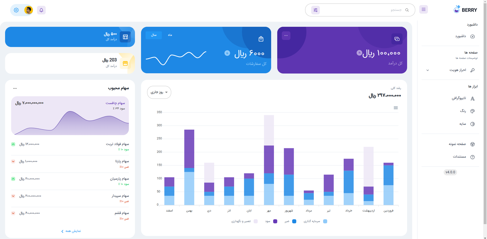
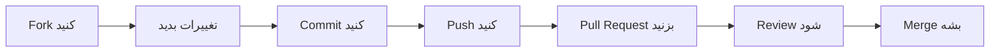

<div align="center">

<div align="center">
  
</div>

<div align="center">
  <p align="center">
  
  
  
  
</p>
</div>

<p align="center">
  <strong>یک پنل مدیریتی مدرن، حرفه‌ای و کاملاً راست‌چین با React</strong>
</p>

<p align="center">
  <a href="#-ویژگی‌ها">ویژگی‌ها</a> •
  <a href="#-نمایش-تصویری">نمایش</a> •
  <a href="#-نصب-و-راه‌اندازی">نصب</a> •
  <a href="#-تکنولوژی‌ها">تکنولوژی‌ها</a> •
  <a href="#-مستندات">مستندات</a> •
  <a href="#-مشارکت">مشارکت</a>
</p>



</div>

---

## 📖 درباره پروژه

<div align="right">

**پنل ادمین React** یک داشبورد مدیریتی مدرن و کاملاً فارسی است که با تکنولوژی‌های روز دنیا ساخته شده. این پروژه به‌صورت کامل راست‌چین (RTL) پیاده‌سازی شده و برای استفاده در پروژه‌های ایرانی بهینه‌سازی شده است.

</div>

```javascript
const AdminPanel = {
  name: "React Admin Panel - RTL",
  version: "1.0.0",
  description: "پنل مدیریتی حرفه‌ای با پشتیبانی کامل از فارسی و راست‌چین",
  features: [
    "🎨 طراحی مدرن و زیبا با Material-UI",
    "📱 کاملاً ریسپانسیو (موبایل، تبلت، دسکتاپ)",
    "🌙 حالت تاریک و روشن",
    "⚡ عملکرد بالا و بهینه",
    "🔐 آماده برای اضافه کردن احراز هویت",
    "📊 نمودارها و ویجت‌های آماده",
    "🎯 کاملاً قابل سفارشی‌سازی"
  ],
  author: "PicoBaz",
  ready: true
};
```

---

## ✨ ویژگی‌ها

<div align="center">

<table dir="rtl">
  <tr>
    <td align="center" width="33%">
      <br>
      <b>⚛️ React 18</b><br>
      <sub>آخرین نسخه React با بهترین عملکرد</sub>
    </td>
    <td align="center" width="33%">
      <br>
      <b>🎨 Material-UI</b><br>
      <sub>کامپوننت‌های زیبا و آماده</sub>
    </td>
    <td align="center" width="33%">
      <br>
      <b>📱 Responsive</b><br>
      <sub>کاملاً سازگار با موبایل و تبلت</sub>
    </td>
  </tr>
  <tr>
    <td align="center" width="33%">
      <br>
      <b>🔄 RTL Support</b><br>
      <sub>پشتیبانی کامل از راست‌چین</sub>
    </td>
    <td align="center" width="33%">
      <br>
      <b>⚡ Performance</b><br>
      <sub>بهینه‌سازی شده و سریع</sub>
    </td>
    <td align="center" width="33%">
      <br>
      <b>🛠️ Customizable</b><br>
      <sub>قابل سفارشی‌سازی آسان</sub>
    </td>
  </tr>
</table>

</div>

---

## 🖼️ نمایش تصویری

<div align="center">

### 📊 داشبورد اصلی


<details>
<summary><b>📸 نمایش بیشتر اسکرین‌شات‌ها</b></summary>

<br>

> **نکته:** اسکرین‌شات‌های بیشتر را می‌توانید در پوشه `screenshots/` پروژه مشاهده کنید.

</details>

</div>

---

## 🚀 نصب و راه‌اندازی

### پیش‌نیازها

<div dir="rtl">

قبل از شروع، مطمئن شوید که موارد زیر را نصب کرده‌اید:

- **Node.js** (نسخه 16 یا بالاتر)
- **npm** یا **yarn** (مدیریت پکیج)
- یک ویرایشگر کد (پیشنهادی: VS Code)

</div>

### مراحل نصب

<div dir="rtl">

**1️⃣ کلون کردن پروژه:**

</div>

```bash
git clone https://github.com/PicoBaz/pannel_admin_react.git
cd pannel_admin_react
```

<div dir="rtl">

**2️⃣ نصب وابستگی‌ها:**

</div>

```bash
# استفاده از npm
npm install

# یا استفاده از yarn
yarn install
```

<div dir="rtl">

**3️⃣ تنظیمات محیطی (اختیاری):**

فایل `.env` را ویرایش کنید:

</div>

```env
REACT_APP_API_URL=http://your-api-url.com
REACT_APP_NAME=پنل مدیریتی
```

<div dir="rtl">

**4️⃣ اجرای پروژه در حالت توسعه:**

</div>

```bash
# استفاده از npm
npm start

# یا استفاده از yarn
yarn start
```

<div dir="rtl">

پروژه روی آدرس [http://localhost:3000](http://localhost:3000) اجرا می‌شود 🎉

</div>

<div dir="rtl">

**5️⃣ ساخت نسخه Production:**

</div>

```bash
# استفاده از npm
npm run build

# یا استفاده از yarn
yarn build
```

<div dir="rtl">

فایل‌های بهینه‌شده در پوشه `build/` ایجاد می‌شوند.

</div>

---

## 🛠️ تکنولوژی‌ها

<div align="center">

### زبان‌ها و فریم‌ورک‌های اصلی


### کتابخانه‌ها و ابزارها


</div>

<div align="center">

### 📦 وابستگی‌های اصلی

| پکیج | نسخه | توضیحات |
|:---:|:---:|:---|
| **React** | ^18.x | فریم‌ورک اصلی |
| **Material-UI** | ^5.x | کامپوننت‌های UI |
| **React Router** | ^6.x | مدیریت روت‌ها |
| **SCSS** | Latest | استایل‌دهی پیشرفته |
| **Vite** | ^5.x | Build Tool سریع |

</div>

---

## 📁 ساختار پروژه

```
pannel_admin_react/
│
├── public/                 # فایل‌های استاتیک
│   ├── index.html
│   └── favicon.svg
│
├── src/                    # کدهای اصلی
│   ├── components/         # کامپوننت‌های React
│   ├── pages/             # صفحات مختلف
│   ├── styles/            # فایل‌های SCSS
│   ├── utils/             # توابع کمکی
│   ├── config/            # تنظیمات
│   ├── App.jsx            # کامپوننت اصلی
│   └── main.jsx           # نقطه ورود
│
├── .env                    # متغیرهای محیطی
├── package.json            # وابستگی‌ها
├── vite.config.mjs        # تنظیمات Vite
├── eslint.config.mjs      # تنظیمات ESLint
└── README.md              # مستندات
```

---

## 📚 مستندات

<div dir="rtl">

### 🎨 سفارشی‌سازی تِم

برای تغییر رنگ‌بندی و تم پنل، فایل `src/config/theme.js` را ویرایش کنید:

</div>

```javascript
export const theme = {
  palette: {
    primary: {
      main: '#1976d2',  // رنگ اصلی
    },
    secondary: {
      main: '#dc004e', // رنگ ثانویه
    },
  },
  direction: 'rtl', // راست‌چین
};
```

<div dir="rtl">

### 🔗 اضافه کردن صفحه جدید

1. یک فایل جدید در `src/pages/` ایجاد کنید
2. روت جدید را در `src/App.jsx` اضافه کنید
3. لینک صفحه را در منوی کناری قرار دهید

</div>

```javascript
// در App.jsx
import NewPage from './pages/NewPage';

<Route path="/new-page" element={<NewPage />} />
```

<div dir="rtl">

### 🎯 اتصال به API

برای اتصال به بک‌اند، از `axios` یا `fetch` استفاده کنید:

</div>

```javascript
// مثال با axios
import axios from 'axios';

const API_URL = process.env.REACT_APP_API_URL;

export const fetchData = async () => {
  try {
    const response = await axios.get(`${API_URL}/data`);
    return response.data;
  } catch (error) {
    console.error('Error:', error);
  }
};
```

---

## 🎓 آموزش‌های مفید

<div align="center">

| موضوع | لینک |
|:---|:---|
| 📘 آموزش React | [React Docs](https://react.dev) |
| 🎨 آموزش Material-UI | [MUI Docs](https://mui.com) |
| 🚀 آموزش Vite | [Vite Guide](https://vitejs.dev) |
| 📝 آموزش SCSS | [SCSS Guide](https://sass-lang.com) |

</div>

---

## 🤝 مشارکت

<div dir="rtl">

ما از مشارکت شما استقبال می‌کنیم! برای مشارکت در پروژه:

</div>

<div align="center">



</div>

<div dir="rtl">

### مراحل مشارکت:

1. **Fork** کردن پروژه
2. ایجاد یک **Branch** جدید (`git checkout -b feature/AmazingFeature`)
3. **Commit** کردن تغییرات (`git commit -m 'Add some AmazingFeature'`)
4. **Push** کردن به Branch (`git push origin feature/AmazingFeature`)
5. باز کردن یک **Pull Request**

</div>

---

## 🐛 گزارش باگ

<div dir="rtl">

اگر باگی پیدا کردید، لطفاً در بخش [Issues](https://github.com/PicoBaz/pannel_admin_react/issues) گزارش دهید:

</div>

<div align="center">

[](https://github.com/PicoBaz/pannel_admin_react/issues/new)
[](https://github.com/PicoBaz/pannel_admin_react/issues/new)

</div>

---

## 📞 ارتباط با من

<div align="center">

[](https://t.me/picobaz)
[](mailto:picobaz3@gmail.com)
[](https://picobaz.site)
[](https://github.com/PicoBaz)

</div>

---

## 📄 لایسنس

<div dir="rtl">

این پروژه تحت لایسنس **MIT** منتشر شده است. برای اطلاعات بیشتر فایل [LICENSE](LICENSE) را مطالعه کنید.

</div>

---

## 🙏 تشکر ویژه

<div dir="rtl">

از تمام کسانی که در توسعه این پروژه مشارکت داشتند، تشکر می‌کنیم:

- تیم React برای یک فریم‌ورک فوق‌العاده
- تیم Material-UI برای کامپوننت‌های زیبا
- جامعه متن‌باز که همیشه الهام‌بخش هستند

</div>

---

## 📊 آمار پروژه

<div align="center">


</div>

---

## ⭐ ستاره بدید!

<div align="center" dir="rtl">

اگر این پروژه برایتان مفید بود، لطفاً یک ⭐ بدید تا از من حمایت کنید!

<br>


</div>

---

<div align="center">

### 💡 "کد خوب، کدی است که دیگران بتوانند بخوانند" 


**ساخته شده با ❤️ توسط [PicoBaz](https://github.com/PicoBaz)**

<p>
  
  
</p>

**[⬆ برگشت به بالا](#)**

</div>
